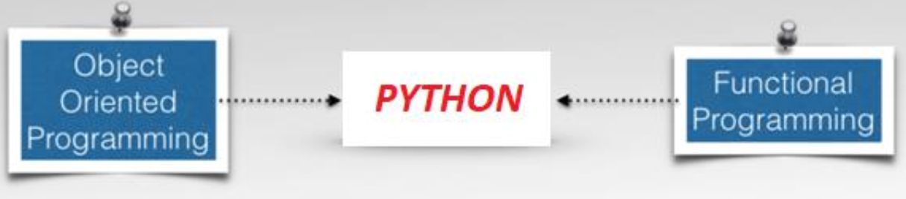
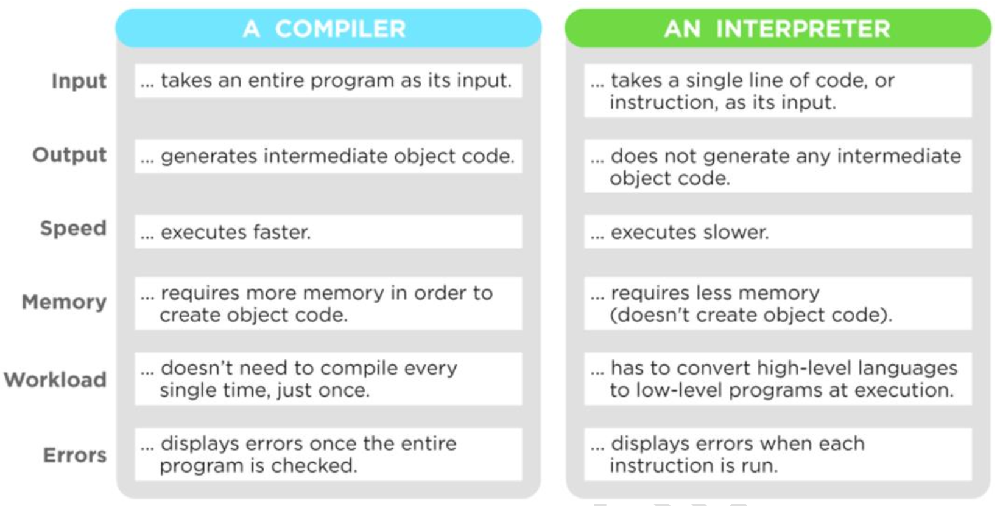
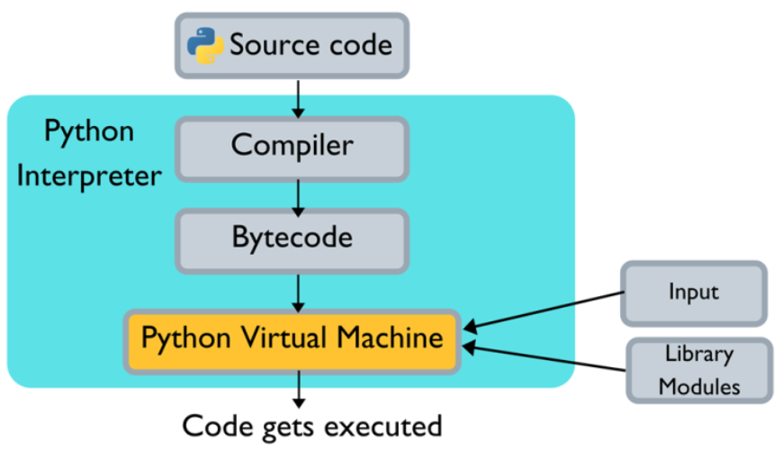

# 🐍 Python Overview

## 📜 Python History

- **Who?**  
  Invented in the **Netherlands** by **Guido van Rossum**.

- **When?**  
  Python was conceived in the **late 1980s**, and its implementation was started in **December 1989**.

- **How Named?**  
  Guido van Rossum is a fan of *“Monty Python’s Flying Circus”*, a famous TV show in the Netherlands — hence the name **Python**.

- **Open Source?**  
  From the very beginning, Python has been **open source**.

---

## 💡 Why Python?

| Feature                                                 | Reason / Explanation                                                                                           |
| ------------------------------------------------------- | -------------------------------------------------------------------------------------------------------------- |
| **Built-in types and library utilities**                | Provides ready-to-use data types (list, dict, tuple, etc.) and a rich standard library for faster development. |
| **Dynamic typing**                                      | You don’t need to declare variable types; Python automatically detects the data type at runtime.               |
| **Strong typing**                                       | Prevents mixing incompatible data types (e.g., can’t add string and integer directly), ensuring safer code.    |
| **Third-party utilities (e.g., Numeric, NumPy, SciPy)** | Large ecosystem of external libraries makes complex tasks like math, data analysis, and AI easier.             |
| **Automatic memory management**                         | Python automatically allocates and frees memory using garbage collection — no manual memory handling needed.   |

---

## 🧠 What is Python?

Python is:  
1. **Interpreter-based**  
2. **Indentation-based**  
3. **High-level**  
4. **General-purpose / Universal**  
5. **Scripting-based**  
6. **Function-based**  
7. **Object-oriented** programming language  



---

### 1. Python is an Interpreter or Complier Language?



---

### 2. How Python Code Gets Executed?

1. Python source code (.py) is first **compiled into bytecode** (.pyc) automatically.
2. The **Python Virtual Machine (PVM)** then **interprets and executes** this bytecode line by line.
3. Only the code is compiled/interpreted — variable values and runtime data are handled in **PVM memory** (similar to JVM’s garbage collection).
4. **.pyi files** can be used to avoid recompiling the same workload repeatedly.
5. **PySpark Case:**
   * Spark uses **JVM**, Python uses **PVM**.
   * When using PySpark, the **PVM runs inside the JVM** to execute Python code and interact with the Spark engine.
   * Note: **JVM cannot run inside PVM.**


---

### 3. Python is Indent Based language. Why?

* Python uses **indentation (spaces or tabs)** to define code blocks instead of braces `{}` or keywords like `BEGIN...END`.
* This enforces **clean formatting**, **readability**, and **structured coding** — making programs easier to read, understand, and maintain.
* Other languages like **SQL**, **Scala**, **Java**, **PL/SQL**, and **Linux Shell scripting** follow a **block-based programming model**, not indentation-based.
* In Python, indentation is part of the **syntax** — missing or incorrect indentation causes errors.
* Standard practice: use **4 spaces** (recommended by PEP 8) or **a single TAB** for indentation.

---

### 4. Why Python is a High-Level Programming Language?

* Python is considered a **high-level programming language** because it abstracts away most hardware details and provides many built-in functions, reducing code complexity.
* It allows developers to focus on **logic** rather than managing memory or system-level operations.
* Though Python can also be used as a **mid-level language**, it is **recommended as high-level** for productivity and simplicity.

**Types of Programming Languages**

| Type                       | Description                                                                                   | Example                                                       |
| -------------------------- | --------------------------------------------------------------------------------------------- |---------------------------------------------------------------|
| **High-Level Programming** | Low complexity, fewer lines of code, mostly uses predefined functions.                        | `len('Hello')`                                                |
| **Mid-Level Programming**  | Medium complexity, moderate lines of code, custom functions or logic written by user.         | a=0<br/>for i in 'hello':<br/>a+=len(i)<br/>print(a)          |
| **Low-Level Programming**  | High complexity, more lines of code, deals with system-level operations (e.g., C, C++, Java). | #include<stdio.h><br/>int main()<br/>{<br/>printf(\"Hello\");<br/>return 0;<br/>}<br/> |

---

### 5. Why Python is General Purpose / Universal?

* Python is called a **General Purpose (or Universal)** programming language because it can be used across **almost all domains and platforms** — not limited to a specific use case.
* It supports applications in **Web Development**, **Data Analytics**, **Machine Learning (ML)**, **Deep Learning (DL)**, **Generative AI**, **Data Engineering (DE)**, **Visualization**, **Automation**, **Middleware**, and many more.
* Being **open source**, Python has a **rich ecosystem of libraries** (like NumPy, Pandas, TensorFlow, Flask, etc.) that make it powerful and versatile.
* Its **strong community support** and **decades of maturity** make it a reliable and **legacy-rich** programming language suitable for both beginners and large-scale enterprise solutions.

---

### 6. Why Python is a Scripting-Based Programming Language

* Python allows you to **write and execute simple instructions directly**, without needing to define functions or classes.
* It behaves like a **script**, where commands run sequentially — perfect for automation, quick tasks, or prototyping.
* There’s **no need to follow strict programming structures or protocols** like in Java or C++.
* You can write a few lines of code and execute them immediately without compilation.

**Example:**

```python
print("Hello, World!")
x = 10
y = 20
print("Sum:", x + y)
```

✅ Runs directly as a script — no class, no function, no boilerplate code required.

---

### 7. Why Python is a Function-Based Programming Language

* Python supports **Functional Programming (FP)**, which focuses on writing programs using **functions** rather than classes or complex structures.
* This approach makes code **modular**, **reusable**, and **easier to test and debug**.
* Functional programming also helps in writing **clean, concurrent, and scalable** applications.

**Advantages of Function-Based Programming**

| Concept                   | Description                                                                                                                            |
| ------------------------- | -------------------------------------------------------------------------------------------------------------------------------------- |
| **First-class Functions** | Functions are treated like variables — they can be assigned to other variables, passed as arguments, or returned from other functions. |
| **Composable**            | Small, simple functions can be **combined** to build more complex functionality.                                                       |
| **No Side Effects**       | A function’s output depends only on its input — running it multiple times gives the same result (pure functions).                      |
| **Simplicity**            | Each function focuses on doing **one thing well**, leading to more reliable and maintainable code.                                     |


**Example:**

```python
def square(x):
    return x * x

def cube(x):
    return x * x * x

# Composing functions
nums = [1, 2, 3, 4]
result = list(map(square, nums))
print(result)  # [1, 4, 9, 16]
```

✅ Python allows both **imperative(how to do)** and **functional(what to do)** styles, but FP makes programs more elegant, readable, and maintainable.

Here’s a clear, structured explanation of **how Python is an Object-Oriented Programming (OOP) language**, covering each point you listed 👇

---

### 8. Python is Object Oriented Programming Language — How?

Python supports all the core **Object-Oriented Programming (OOP)** principles such as **Encapsulation, Inheritance, Polymorphism, and Abstraction**.
Everything in Python — from numbers to functions — is an **object**.

#### **1️⃣ Package, Subpackage, and Module**

* **Module:**
  A Python file (`.py`) that contains variables, functions, or classes.
  Example:

  ```python
  # file: math_utils.py
  def add(a, b):
      return a + b
  ```

* **Package:**
  A collection of related modules kept in a directory with an `__init__.py` file.
  Example structure:

  ```
  mypackage/
      __init__.py
      math_utils.py
      string_utils.py
  ```

* **Subpackage:**
  A package inside another package (used for better organization).
  Example:

  ```
  myproject/
      __init__.py
      utils/
          __init__.py
          file_utils.py
  ```

✅ **In short:**
Package → folder containing modules
Module → single Python file
Subpackage → nested package


#### **2️⃣ Class**

A **class** is a blueprint or template to create objects.
It can contain **variables (attributes)** and **functions (methods)** that describe the behavior of the object.

Example:

```python
class Student:
    school_name = "ABC Public School"   # Class variable

    def __init__(self, name, age):      # Constructor
        self.name = name                # Member Data /Variable
        self.age = age                  # Member Data /Variable

    def show(self):                     # Member function
        print(f"Name: {self.name}, Age: {self.age}")
```


#### **3️⃣ Members (Variables and Functions inside a Class)**

* **Data Members (Variables):** Hold data specific to the object or class.
* **Member Functions (Methods):** Define the behavior of that data.

Example:

```python
class Car:
    def __init__(self, brand, color):
        self.brand = brand        # data member
        self.color = color        # data member

    def start(self):              # member function
        print(f"{self.color} {self.brand} started!")
```

#### **4️⃣ Constructor**

* The **constructor** in Python is a special method named `__init__()`.
* It automatically executes when an object is created.
* Purpose: Initialize object properties.

Example:

```python
class Employee:
    def __init__(self, name, dept):
        self.name = name
        self.dept = dept
```

#### **5️⃣ Object (Instance of the Class)**

An **object** is a real instance created from a class — it occupies memory.
You call a class like a function to create an object:

```python
e1 = Employee("Murali", "Big Data")
print(e1.name)       # Accessing data member
```

✅ When you create an object (like `e1`), the constructor runs automatically and loads the class into memory.

#### **In Simple Words**

| Concept              | Meaning                          | Example                   |
| -------------------- | -------------------------------- |---------------------------|
| **Class**            | Blueprint / Template             | `class Student:`          |
| **Object**           | Real instance in memory          | `s1 = Student()`          |
| **Members**          | Variables & functions in a class | `self.name`, `def show()` |
| **Constructor**      | Initializes object properties    | `__init__()`              |
| **Package / Module** | Organizes Python code            | `import myproject.utils`  |

---