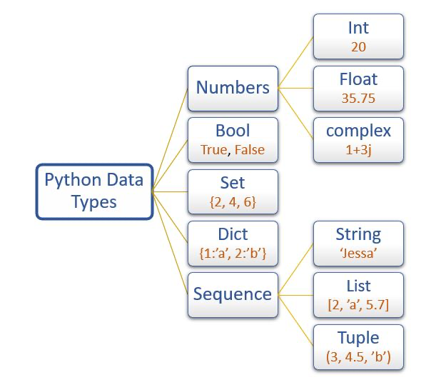
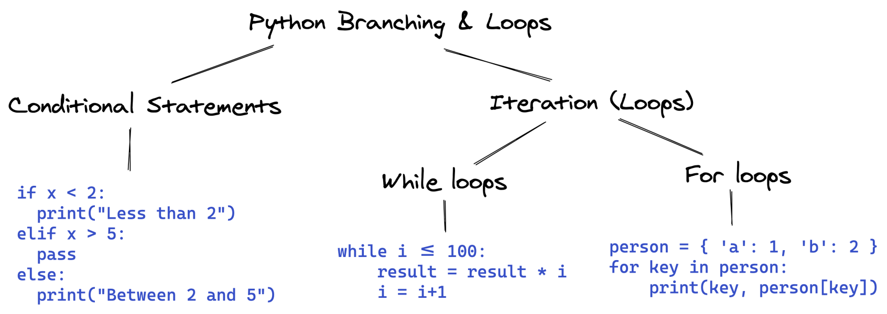
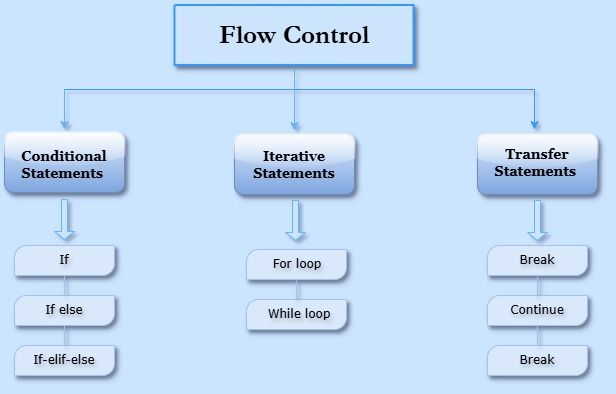

# Python Programming


# 🎯 Variables:



## 1. Create two variables `x = 100` and `y = 10`, find their multiplication and division, and store the results in variables `z` and `z1`.
```python
x = 100
y = 10
z = x * y
z1 = x / y
print("type(z):",type(z), "z:",z)
print("type(z1):", type(z1), "z1:", z1)
```

```
type(z): <class 'int'> z: 1000
type(z1): <class 'float'> z1: 10.0
```


## 2. Create a variable `a = 2000`, divide `a` by `y` (from step 1), and reassign `a` with the divided result.

```python

print()

a = 2000
a = a / y
print("type(a):",type(a),"a:",a)
```

```
type(a): <class 'float'> a: 200.0
```

## 3. Prove Python is dynamically typed by creating `x: int = 100`, then assigning `y = str(x)` and printing the types of `x` and `y`.
```python
print()

x: int = 100
y = str(x)
print("type(x):",type(x))
print("type(y):",type(y))
```

```
type(x): <class 'int'>
type(y): <class 'str'>
```


## 4. Demonstrate Python’s dynamic inference feature with an example showing automatic datatype detection.
```python

print()

code = 100
print("code=",code)
print("type(code)=",type(code))

code = "Hundred"
print("code=",code)
print("type(code)=",type(code))

code = 100/100
print("code=",code)
print("type(code)=",type(code))

code = [1,2,3,4]
print("code=",code)
print("type(code)=",type(code))

code = (1,2,3,4)
print("code=",code)
print("type(code)=",type(code))

code = {1,2,3,4}
print("code=",code)
print("type(code)=",type(code))

code = {"empid":1,"name":"jack"}
print("code=",code)
print("type(code)=",type(code))

code = True
print("code=",code)
print("type(code)=",type(code))

```
```
code= 100
type(code)= <class 'int'>

code= Hundred
type(code)= <class 'str'>

code= 1.0
type(code)= <class 'float'>

code= [1, 2, 3, 4]
type(code)= <class 'list'>

code= (1, 2, 3, 4)
type(code)= <class 'tuple'>

code= {1, 2, 3, 4}
type(code)= <class 'set'>

code= {'empid': 1, 'name': 'jack'}
type(code)= <class 'dict'>

code= True
type(code)= <class 'bool'>
```

## 5. Prove Python is a strongly typed language using incompatible type operations.
```python

print()

name = "Alan Harpor"
age = 40

print("name=",name,"type(name)=",type(name))
print("age=",age,"type(age)=",type(age))

#concatenate string + number is not possible
#concate_name_age = name + age # strongly typed
```

```
name= Alan Harpor type(name)= <class 'str'>
age= 40 type(age)= <class 'int'>
TypeError: can only concatenate str (not "int") to str
```

## 6. Create variables `a, b, c, d` assigned with values `10, 20, 30, 40` respectively.
```python
print()

a = 10
b = 20
c = 30
d = 40
print(f"a={a} b={b} c={c} d={d}")

# OR

a,b,c,d = 10,20,30,40
print(f"a={a} b={b} c={c} d={d}")
```

## 7. Prove that Python variable names are case-sensitive.
```python
print()

name = "Alan Harpor"
Name = "alan harpor"
print(f"name={name} | Name={Name}")
```

```
name=Alan Harpor Name=alan harpor
```

## 8. Demonstrate that variable names cannot start with numbers or contain special characters (except `_`).
```python
print()

_number = 100  # valid
number_ = 100  # valid
```

```
1number = 100  # not valid
$number = 100  # not valid
num$ber = 100  # not valid
```

## 9. Show examples of using single, double, and triple quotes in Python.
```python
print()

name = 'I cant wait'
print(name)
name = "I can't wait"
print(name)
name = """I 
can't 
wait
"""
print(name)
```

```
I cant wait
I can't wait
I 
can't 
wait
```

## 10. Demonstrate examples using arithmetic, assignment, comparison, relational, and logical operators.
```python
print()

a = 3
b = 2
c = 1

print(f"a = {a} | b = {b} | c = {c}")

print("Arithmetic Operations Examples:")
print("1. Addition(+)        : a+b+c = ",a+b+c)
print("2. Subtraction(-)     : a-b-c = ",a-b-c)
print("3. Multiplication(*)  : a*b*c = ",a*b*c)
print("4. Division(/)        : a/b/c = ",a/b/c)
print("5. Modulus(%)         : a%b   = ",a%b)
print("6. Exponentiation(**) : a**b  = ",a**b)
print("7. Floor Division(//) : a//b  = ",a//b)

print()
print("Relational Operator Examples:")
print("1. Equal To (==)                 : a == b = ",a == b)
print("2. Not Equal To (!=)             : a != b = ",a != b)
print("3. Greater Than (>)              : a > b  = ",a > b)
print("4. Less Than (<)                 : a < b  = ",a < b)
print("5. Greater Than and Equal To (>=): a >= b = ",a >= b)
print("6. Less Than and Equal To (<=)   : a <= b = ",a <= b)

print()
print("Logical Operators Examples:")
a = True
b = False
print(f"a = {a} | b = {b}")
print("1. AND (a and b) = ",a and b)
print("2. OR (a or b) = ",a or b)
print("3. NOT (not b) = ", not b)

print()
print("Assignment Operators Examples:")
a = 5
print("1. Simple Assignment (a = 5) = ", a)
a += 5
print("2. Add and Assign (a += 5) => (a = a + 5)      = ", a)
a = 5; a -= 5
print("3. Subtract and Assign (a -= 5) => (a = a - 5) = ", a)
a = 5; a *= 5
print("4. Multiply and Assign (a *= 5) => (a = a * 5) = ", a)
a = 5; a /= 5
print("5. Division and Assign (a /= 5) => (a = a / 5) = ", a)
a = 5; a %= 5
print("6. Modulus and Assign (a %= 5) => (a = a % 5)  = ", a)
a = 5; a **= 5
print("7. Exponentiation and Assign (a **= 5) => (a = a ** 5) = ", a)
a = 5; a //= 5
print("8. Floor Division and Assign (a //= 5) => (a = a // 5) = ", a)

```

```
a = 3 | b = 2 | c = 1

Arithmetic Operations Examples:
1. Addition(+)        : a+b+c =  6
2. Subtraction(-)     : a-b-c =  0
3. Multiplication(*)  : a*b*c =  6
4. Division(/)        : a/b/c =  1.5
5. Modulus(%)         : a%b   =  1
6. Exponentiation(**) : a**b  =  9
7. Floor Division(//) : a//b  =  1

Relational Operator Examples:
1. Equal To (==)                 : a == b =  False
2. Not Equal To (!=)             : a != b =  True
3. Greater Than (>)              : a > b  =  True
4. Less Than (<)                 : a < b  =  False
5. Greater Than and Equal To (>=): a >= b =  True
6. Less Than and Equal To (<=)   : a <= b =  False

Logical Operators Examples:
a = True | b = False
1. AND (a and b) =  False
2. OR (a or b) =  True
3. NOT (not b) =  True

Assignment Operators Examples:
1. Simple Assignment (a = 5) =  5
2. Add and Assign (a += 5) => (a = a + 5)      =  10
3. Subtract and Assign (a -= 5) => (a = a - 5) =  0
4. Multiply and Assign (a *= 5) => (a = a * 5) =  25
5. Division and Assign (a /= 5) => (a = a / 5) =  1.0
6. Modulus and Assign (a %= 5) => (a = a % 5)  =  0
7. Exponentiation and Assign (a **= 5) => (a = a ** 5) =  3125
8. Floor Division and Assign (a //= 5) => (a = a // 5) =  1

```

# 🎯 Conditional Structures:


## 11. Write a program to find the greatest of three numbers.
```python
print()

a = 1; b=2; c=3
print(f"a = {a} | b = {b} | c = {c}")
if a > b and a > c:
    print("{a} is greater than {b} and {c}")
elif b > a and b > c:
    print("{b} is greater than {a} and {c}")
elif c > a and c > b:
    print("{c} is greater than {a} and {b}")
else:
    pass
```

## 12. Write a single program to check if a number is even or negative and print the result as: “Even but not negative”, “Not even but negative”, “Neither even nor negative”
```python
print()

numbers = [-5,-4,-3,-2,-1,0,1,2,3,4,5]
print(f"numbers:{numbers}")

for number in numbers:
    if number % 2 == 0 and number > 0:
        print(f"The given number {number} is even and positive.")
    elif number % 2 == 0 and number < 0:
        print(f"The given number {number} is even and negative.")
    elif number % 2 != 0 and number > 0:
        print(f"The given number {number} is odd and positive.")
    elif number % 2 != 0 and number < 0:
        print(f"The given number {number} is odd and negative.")
    else:
        print(f"The given number {number} is zero.")

```

## 13. Write a nested `if-else` structure to print course fees:
```
* Big Data → 25000
* Spark → 15000
* Data Science →
  * Machine Learning → 25000
  * Deep Learning → 45000
  * Both → 50000
```

```python
print('''
1. BigData
2. Spark
3. DataScience
  4. MachineLearning
  5. DeepLearning
  6. Both
''')
print("Enter the course name or number:")
course = input()
print("input => course = ",course)

fee = 0

# Check if the course is numeric
if course.isdigit():
    course_int = int(course)
else:
    course_int = None

# Logic
if course_int == 1 or course.lower() == "bigdata" :
    fee = 25000
    course = "Big Data"
elif course_int == 2 or course.lower() == "spark" :
    fee = 15000
    course = "Spark"
elif course_int == 3 or course.lower() == "datascience" :
    fee = 70000
    course = "Data Science"
elif course_int == 4 or course.lower() == "machinelearning" :
    fee = 25000
    course = "Machine Learning"
elif course_int == 5 or course.lower() == "deeplearning" :
    fee = 45000
    course = "Deep Learning"
elif course_int == 6 or course.lower() == "both" :
    fee = 70000
    course = "Machine Learning & Deep Learning"
else:
    pass

if fee != 0:
    print(f"Entered course '{course}' fee is Rs.{fee}.")
else:
    print("Entered the course is not available.")
```

```
1. BigData
2. Spark
3. DataScience
  4. MachineLearning
  5. DeepLearning
  6. Both

Enter the course name or number:
3
input => course =  3
Entered course 'Data Science' fee is Rs.70000.
```

## 14. Check whether a given string is a palindrome using a reverse function.
```python
print()

print("Enter the word to check whether it is a plaindrome or not:")
word = "madam"##input()

reversed_word = ""
for i in word:
    reversed_word = i + reversed_word
# OR
reversed_word = "".join(reversed(word))
print(f"reversed_word:{reversed_word}")


if word == reversed_word:
    print(f"The entered the word '{word}' is a plaindrome.")
else:
    print(f"The entered the word '{word}' is not a plaindrome.")
```

```
Enter the word to check whether it is a plaindrome or not:
madam
reversed_word:madam
The entered the word 'madam' is a plaindrome.```
```

## 15. Check whether `x = 100` is an integer or a string using functions like `isinstance()` or `type()`.
```python
print()

x = 'hello'
print("Entered the value:",x)

if isinstance(x, int):
    print(f"{x} is an integer.")
elif isinstance(x, str):
    print(f"{x} is a string.")

# OR
if type(x) == int :
    print(f"{x} is an integer.")
elif type(x) == str:
    print(f"{x} is a string.")
```

```
Entered the value: hello
hello is a string.
hello is a string.
```

# 🎯 Control Statements:



## 16. Write a program using for loop to print even numbers and odd numbers in the below range of data (generate using range function) [5,6,7,8,9,10,11,12,13,14,15,16,17,18,19,20] output should be with even as 6,8,10,12,14,16,18,20 and odd as 5,7,9,11,13,15,17,19.
```python
print()

numbers = list(range(5,20))
print("Numbers:",numbers)

oddNumbers = ""
evenNumbers = ""
for i in numbers:
  if i%2 != 0 :
      oddNumbers = oddNumbers + str(i) + ","
  else:
      evenNumbers = evenNumbers + str(i) + ","

print(f"oddNumbers: {oddNumbers}")
print(f"evenNumbers: {evenNumbers}")

```

```
Numbers: [5, 6, 7, 8, 9, 10, 11, 12, 13, 14, 15, 16, 17, 18, 19]
oddNumbers: 5,7,9,11,13,15,17,19,
evenNumbers: 6,8,10,12,14,16,18,
```


## 17. Write a while loop to loop from 0 till 21 with the increment of 3, the result should be exactly 3,6,9,12,15,18 and store this result in a list
```python
print()

x = 0
result = []
while x < 21 :
    if x%3 == 0 and x !=0:
        result.append(x)
    x += 1
print("result:",result)
```

```
result: [3, 6, 9, 12, 15, 18]
```

## 18. Write a for or while loop to print the cube of 4, result should be 4*4*4=64 (initiate some variable outside the loop with 4 and loop through 3 times to achieve the result)
```python
print()

number = int(input("Enter the number:"))
cubeNumber = int(input("Enter the cube number:"))
x = 1
result = 1
while x <= cubeNumber:
    result = result * number
    x += 1
print("result:",result)
```

```
Enter the number:4
Enter the cube number:4
result: 256
```

## 19. Create a list as sal_lst=[10000,20000,30000,10000,15000], loop through the list and add 1000 bonus to the salary and store in another list sal_bonus_lst=[11000,21000,31000,11000,16000] then store the bonus applied salary in another list where sal>11000

```python
print()

sal_lst=[10000,20000,30000,10000,15000]
revised_sal_lst = []
revised_sal = 0
bonus = 1000
sal_gt_11000 = []

for i in sal_lst:
    revised_sal = i + bonus
    revised_sal_lst.append(revised_sal)
    if revised_sal > 11000:
        sal_gt_11000.append(revised_sal)

print("revised_sal_lst:",revised_sal_lst)
print("sal_gt_11000:",sal_gt_11000)
```

```
revised_sal_lst: [11000, 21000, 31000, 11000, 16000]
sal_gt_11000: [21000, 31000, 16000]
```

## 20. Write a do while loop to print “Inception Technologies” n number of times as per the input you get from the user. Minimum it has to be printed at least one time regardless of the user input.

```python
print()

text = "Inception Technologies"
nooftimes = int(input("How many times you want to print? "))

x = 1
if nooftimes <= 0:
    nooftimes = 1

while x <= nooftimes:
    print(text)
    x += 1
```

```
How many times you want to print? 2
Inception Technologies
Inception Technologies
```

## 21. From the given list of list of elements produce the following output using nested for loop lst1=[[10,20],[30,40,50],[60,70,80]], calculate the sum of all number, calculate the min value and the max value of all the elements in the lst1.

```python
print()

startNumber = 10
reqlist = [2,3,4]
lst1 = []
value =0

for length in reqlist:
    x = 1
    tmpList = []
    while x <= length:
        x += 1
        value = value + 10
        tmpList.append(value)
    lst1.append(tmpList)

print("lst1: ",lst1)


allNumbers = []
for numbers in lst1:
    length = len(numbers)
    if length >1:
        x = 1
        while x <= length:
            x += 1
            for number in numbers:
                allNumbers.append(number)
    elif length ==1:
        allNumbers.append(number)
    else:
        pass

print("Sum of all numbers: ",allNumbers)
print("Min value from the list: ",min(allNumbers))
print("Max value from the list: ",max(allNumbers))
```

```
lst1:  [[10, 20], [30, 40, 50], [60, 70, 80, 90]]
Sum of all numbers:  [10, 20, 10, 20, 30, 40, 50, 30, 40, 50, 30, 40, 50, 60, 70, 80, 90, 60, 70, 80, 90, 60, 70, 80, 90, 60, 70, 80, 90]
Min value from the list:  10
Max value from the list:  90
```

## 22. Create a looping construct to print the multiplication table for 3 up to 10.
```
print()

tableOf=int(input("Which multiplication do you want? "))
upToMax=int(input("Evaluate up to how many numbers? "))
upToSeq=1

while upToSeq <= upToMax:
    print(f"{upToSeq} * {tableOf} = {upToSeq*tableOf}")
    upToSeq += 1
```

```
Which multiplication do you want? 2
Evaluate up to how many numbers? 5
1 * 2 = 2
2 * 2 = 4
3 * 2 = 6
4 * 2 = 8
5 * 2 = 10
```

# 🎯 Collections: List, Dictionary, Tuple and Set

| | Feature | Python Example |
| :--- | :--- | :--- |
| **1.** | A collection is a **container data structure**. Collection or group of values that stored in a format for managing the complex data efficiently. | `my_collection = [1, 2, 3, 4, 5]` \# Create a collection (list) |
| **2.** | It contains **zero or more elements**. | `print(my_collection)` \# Print the collection with 5 elements <br> `empty_collection = []` \# Create an empty collection <br> `print(empty_collection)` \# Print the empty collection |
| **3.** | Collections provide a **higher-level abstraction** for working with data. | `print(len(my_collection))` \# Get the length of the collection <br> `print(max(my_collection))` \# Get the maximum value in the collection |
| **4.** | They enable **declarative(SQL) programming**. | `double_values = [x * 2 for x in my_collection]` \# Declarative programming example <br> `print(double_values)` \# Print the doubled values |
| **5.** | With an easy-to-use interface, they **eliminate the need to manually iterate or loop** through all the elements. | `print(sum(my_collection))` \# Get the sum of the collection without manual iteration |


<details>
  <summary> Comparision Table </summary>
  
</details>


## 23. Create a list with a range of 10 values starting from 2 to 11 and prove mutability by updating the 3rd element with 100 and prove resizable properties by adding 100 in the 5th position.
```python
print()

rangeList = list(range(2,11))
print("rangeList: ",rangeList)

#Updating 3rd element with 100
rangeList[2]=100
print("updated rangeList: ",rangeList)

#Inserting a new value 100 in the 5th position
rangeList.insert(4,100)
print("resized rangeList: ",rangeList)
```

```
rangeList:  [2, 3, 4, 5, 6, 7, 8, 9, 10]
updated rangeList:  [2, 3, 100, 5, 6, 7, 8, 9, 10]
resized rangeList:  [2, 3, 100, 5, 100, 6, 7, 8, 9, 10]
```

## 24. Create a tuple of 2 fields eg. ("Inception","Technologies","Pvt","Ltd"), prove immutability and non-resizable nature, access the 2nd and 4th fields and store in another tuple.
```python
print()

namesTuple = ("Inception","Technologies","Pvt","Ltd")
# namesTuple[0]= "The" # Tuples don't support item assignment
# .append() or .insert() are not available for tuples

namesList = []
i = 0
length = len(namesTuple)

for name in namesTuple:
    if i in (1,3):
         namesList.append(name)
    i += 1
print("filteredNames: ",namesList)

```

```
filteredNames:  ['Technologies', 'Ltd']
```

## 25. Convert the list of tuples [("Inception","Technologies"),("Apple","Incorporation")] to list of dictionary type, using for loop as given below [{"Inception":"Technologies"},{"Apple":"Incorporation"}] , once the list of dictionary is arrived print only "Incorporation" by passing "Apple" as a key using dict["Apple"] and dict.get("Apple") and try with dict["Apple1"] and dict.get("Apple1") then find the difference between get and using[] notation.
```python
print()

listOfTuples = [("Inception","Technologies"),("Apple","Incorporation")]
#dictOfTuples = dict(listOfTuples)
#print("dictOfTuples: ",dictOfTuples)

dictOfTuples = {}
for list1 in listOfTuples:
    i = 0
    key = ""
    value = ""
    for element in list1:
        if i == 0:
            key = element
        elif i == 1:
            value = element
        else:
            pass
        i += 1
    dictOfTuples[key]=value

print("dictOfTuples: ",dictOfTuples)
print("dictOfTuples['Apple']: ",dictOfTuples['Apple'])
print("dictOfTuples['Inception']: ",dictOfTuples['Inception'])
#print("dictOfTuples['Apple1']: ",dictOfTuples['Apple1'])            # This will throw an error. Alternate is dictOfTuples.get('Apple1').
#print("dictOfTuples['Inception1']: ",dictOfTuples['Inception1'])    # This will throw an error. Alternate is dictOfTuples.get('Inception1').

print("dictOfTuples.get('Apple'): ",dictOfTuples.get("Apple"))
print("dictOfTuples.get('Inception'): ",dictOfTuples.get("Inception"))
print("dictOfTuples.get('Apple1'): ",dictOfTuples.get("Apple1"))
print("dictOfTuples.get('Inception1'): ",dictOfTuples.get("Inception1"))
```

```
dictOfTuples:  {'Inception': 'Technologies', 'Apple': 'Incorporation'}
dictOfTuples['Apple']:  Incorporation
dictOfTuples['Inception']:  Technologies
dictOfTuples.get('Apple'):  Incorporation
dictOfTuples.get('Inception'):  Technologies
dictOfTuples.get('Apple1'):  None
dictOfTuples.get('Inception1'):  None
```

## 26. Create a list of tuple as given below and delete all duplicate tuples of the list  lst=[("Inceptez","Technologies"),("Apple","Incorporation"),("Inceptez","Technologies"),("Inceptez","Technologies")]
```python

print()

lst=[("Inception","Technologies"),("Apple","Incorporation"),("Inception","Technologies"),("Inception","Technologies")]
print("OriginalList: ",lst)
distinct_set = set(lst)
print("distinct_set: ",distinct_set)
distinct_list = list(distinct_set)
print("distinct_list: ",distinct_list)

"""
OriginalList:  [('Inception', 'Technologies'), ('Apple', 'Incorporation'), ('Inception', 'Technologies'), ('Inception', 'Technologies')]
distinct_set:  {('Apple', 'Incorporation'), ('Inception', 'Technologies')}
distinct_list:  [('Apple', 'Incorporation'), ('Inception', 'Technologies')]
"""
```

## 27. Append a new tuple `("Intel", "Corp")` to the de-duplicated list.
```python
print()

distinct_list.append(("Intel", "Corp"))
print("distinct_list: ",distinct_list)
```

```
distinct_list:  [('Apple', 'Incorporation'), ('Inception', 'Technologies'), ('Intel', 'Corp')]
```

## 28. Convert the lst_dict= [{"Inception":"Technologies"},{"Apple":"Incorporation"}] to lst1=["Inception","Apple"] , think about using for loop, list() function, keys function and list append functions to achieve this.
```python

print()

lst_dict= [{"Inception":"Technologies"},{"Apple":"Incorporation"}]
final_list = []
for item in lst_dict:
    for key,value in item.items():
        final_list.append(key)
print("final_list: ",final_list)
```

```
final_list:  ['Inception', 'Apple']
```


## 29. Create a list of values lst=[10,20,40,30,20], find the first, last values of the list, sort the list in ascending order, sort in descending order, print the minumum and maximum values of the descending sorted list, find the sum of all elements in the list, remove the number 30 and 20 from the list.
```python
print()

lst = [10,20,40,30,20]
print(f"Original List: {lst}")

# 1. Find the first, last values of the list
length = len(lst)
print(f"First value: {lst[0]} Last value: {lst[length-1]}")

# 2. Sort the list in ascending order
lst.sort(reverse=False)
print(f"Sorted list ascending: ",lst)

# 3. Sort the list in decending order
lst.sort(reverse=True)
print(f"Sorted list decending: ",lst)

# 4. Minumum and maximum values of the descending sorted list
print(f"Minimum value: {min(lst)} Maximum value: {max(lst)}")

# 5. Find the sum of all elements in the list
print(f"Sum of all the elements: {sum(lst)}")

# 6. Remove the number 30 and 20 from the list
lst.remove(30)
lst.remove(20)
print(f"After remove the number 30 and 20 from the list: {lst}")

```

```
Original List: [10, 20, 40, 30, 20]
First value: 10 Last value: 20
Sorted list ascending:  [10, 20, 20, 30, 40]
Sorted list decending:  [40, 30, 20, 20, 10]
Minimum value: 10 Maximum value: 40
Sum of all the elements: 120
After remove the number 30 and 20 from the list: [40, 20, 10]
```

## 30. Perform the same operations from step 29 on a tuple `(10,20,40,30,20)`.
```python
print()

lst = (10,20,40,30,20)
print(f"Original List: {lst}")

# 1. Find the first, last values of the list
length = len(lst)
print(f"First value: {lst[0]} Last value: {lst[length-1]}")

# 2. Sort the list in ascending order
sorted_lst = sorted(lst)
print(f"sorted_lst ascending: {sorted_lst}")

# 3. Sort the list in decending order
sorted_lst = sorted(lst,reverse=True)
print(f"sorted_lst decending: {sorted_lst}")

# 4. Minumum and maximum values of the descending sorted list
print(f"Min value: {min(sorted_lst)} Max value: {max(sorted_lst)}")

# 5. Find the sum of all elements in the list
print(f"Sum of all elements: {sum(sorted_lst)}")

# 6. Remove the number 30 and 20 from the list
sorted_lst.remove(30)
sorted_lst.remove(20)
print(f"Final list: {sorted_lst}")

```

```
Original List: (10, 20, 40, 30, 20)
First value: 10 Last value: 20
sorted_lst ascending: [10, 20, 20, 30, 40]
sorted_lst decending: [40, 30, 20, 20, 10]
Min value: 10 Max value: 40
Sum of all elements: 120
Final list: [40, 20, 10]
```

## 31. Convert the string `"Inception Technologies Pvt Ltd"` to a list `['Inception', 'Technologies', 'Pvt', 'Ltd']`.
```
print()

name = "Inception Technologies Pvt Ltd"
nameList = name.split(sep=" ")
print("name: ",name)
print("nameList: ",nameList)
```

## 32. Given:
emplstlst = [["1", ("Arun","Kumar"), "10000"], ["2", ("Bala","Mohan"), "12000"]]  

Perform:  
a. Convert the first sublist to a tuple.  
b. Reverse the first and last name of the second element.  
c. Convert the entire list into tuples of tuples.  
d. Calculate the total salary.  


```python

print()

emplstlst = [["1", ("Arun","Kumar"), "10000"], ["2", ("Bala","Mohan"), "12000"]]

# a. Convert the first sublist to a tuple.
tupFirstList = tuple(emplstlst[0])
print(f"First tuple sublist: ",tupFirstList)

# b. Reverse the first and last name of the second element.
secElement = sorted(emplstlst[1][1],reverse=True)
print(f"secElement: {secElement}")

# c. Convert the entire list into tuples of tuples.
emplstlst_tuple = tuple(emplstlst)
print(f"emplstlst_tuple: {emplstlst_tuple}")

# d. Calculate the total salary.
sal = 0
for item in emplstlst:
    sal = sal + int(item[2])

print(f"Total Sal: {sal}")
```

# 🎯 Functions:

## 33. Write 'def' functions to make the above usecases (conditional from 11 to 15 and control statements 16 to 22) and the upcoming usecases more generic.

### 11. Write a program to find the greatest of three numbers.
```python
print()

def max_of_three(a:int, b:int, c:int):
    '''Purpose: Function to find the greatest of three numbers'''
    try:
        print(f"a = {a} | b = {b} | c = {c}")
        if a > b and a > c:
            print("{a} is greater than {b} and {c}")
        elif b > a and b > c:
            print("{b} is greater than {a} and {c}")
        elif c > a and c > b:
            print("{c} is greater than {a} and {b}")
        else:
            pass
    except Exception as e:
        return f"[Exception] {e}"
max_of_three(1,2,0) # Positional Argument Function Call
max_of_three(a=1,b=2,c=0) # Named Argument Function Call
```

```
a = 1 | b = 2 | c = 0
{b} is greater than {a} and {c}
Max of three - positional (1,2,0):  None
a = 1 | b = 2 | c = 0
{b} is greater than {a} and {c}
Max of three - named (1,2,0):  None
```

### 12. Write a single program to check if a number is even or negative and print the result as: “Even but not negative”, “Not even but negative”, “Neither even nor negative”
```python
print()

def findout_even_odd_positive_negative(number:int):
    '''Purpose: Function to find out given number is even/odd & positive/negative.'''
    try:
        if number % 2 == 0 and number > 0:
            return (f"The given number {number} is even and positive.")
        elif number % 2 == 0 and number < 0:
            return (f"The given number {number} is even and negative.")
        elif number % 2 != 0 and number > 0:
            return (f"The given number {number} is odd and positive.")
        elif number % 2 != 0 and number < 0:
            return (f"The given number {number} is odd and negative.")
        else:
            return (f"The given number {number} is zero.")
    except Exception as e:
        return f"Execption occured {e}"

numbers = [-2,-1,0,1,2]
for i in numbers:
    print(findout_even_odd_positive_negative(i))
```

```
The given number -2 is even and negative.
The given number -1 is odd and negative.
The given number 0 is zero.
The given number 1 is odd and positive.
The given number 2 is even and positive.
```

### 13. Write a nested if then else to print the course fees - check if student choosing bigdata, then fees is 25000, if student choosing spark then fees is 15000, if the student choosing datascience then check if machinelearning then 25000 or if deep learning then 45000 otherwise if both then 25000+25000.

```python
print()

def get_course_fee(course):
    '''Purpose: Get the course fee.'''

    try:
        fee = 0

        # Check if the course is numeric
        if course.isdigit():
            course_int = int(course)
        else:
            course_int = None

        # Logic
        if course_int == 1 or course.lower() == "bigdata" :
            fee = 25000
            course = "Big Data"
        elif course_int == 2 or course.lower() == "spark" :
            fee = 15000
            course = "Spark"
        elif course_int == 3 or course.lower() == "datascience" :
            fee = 70000
            course = "Data Science"
        elif course_int == 4 or course.lower() == "machinelearning" :
            fee = 25000
            course = "Machine Learning"
        elif course_int == 5 or course.lower() == "deeplearning" :
            fee = 45000
            course = "Deep Learning"
        elif course_int == 6 or course.lower() == "both" :
            fee = 70000
            course = "Machine Learning & Deep Learning"
        else:
            pass

        if fee != 0:
            return f"Course fee is {fee}"
        else:
            return "Entered the course is not available."
    except Exception as e:
        return f"Exception occured. {e}"

print('''
1. BigData
2. Spark
3. DataScience
  4. MachineLearning
  5. DeepLearning
  6. Both
''')
print("Enter the course name or number:")
course = input()
print(get_course_fee(course))
```

```
1. BigData
2. Spark
3. DataScience
  4. MachineLearning
  5. DeepLearning
  6. Both

Enter the course name or number:
3
Course fee is 70000
```

### 14. Check whether the given string is palindrome or not (try to use some function like reverse). For eg: x="madam" and y="madam", if x matches with y then print as "palindrome" else "not a  palindrome".
```python
print()

def palindrome_check(word):
    '''Purpose: To check the entered text/number is plaindrome or not.'''
    try:
        reversed_word = ""
        for i in word:
            reversed_word = i + reversed_word
        # OR
        reversed_word = "".join(reversed(word))
        print(f"Entered Word: {word}")
        print(f"Reversed Word: {reversed_word}")

        if word == reversed_word:
            return True
        else:
            return False
    except Exception as e:
        return f"Exception occured. {e}"


word = "madam"  ##input()
print(f"Plaindrome check is {palindrome_check(word)}")

```

```
Entered Word: madam
Reversed Word: madam
Plaindrome check is True
```

### 15. Check whether the x=100 is an integer or string. (try to use some functions like str or upper function etc to execute this use case) or use isinstanceof(variablename,datatype) function.

```python
print()

def check_string_or_int(x):
    '''Purpose: Check the entered text is string or int.'''
    try:
        if isinstance(x, int):
            print(f"{x} is an integer.")
        elif isinstance(x, str):
            print(f"{x} is a string.")

        # OR
        if type(x) == int :
            return (f"{x} is an integer.")
        elif type(x) == str:
            return(f"{x} is a string.")
    except Exception as e:
        return f"Exception occured. {e}"

x = 'hello'
print(f"Entered the value {check_string_or_int(x)}")
x = 100
print(f"Entered the value {check_string_or_int(x)}")

```

```
hello is a string.
Entered the value hello is a string.
100 is an integer.
Entered the value 100 is an integer.
```

### 16. Write a program using for loop to print even numbers and odd numbers in the below range of data (generate using range function) [5,6,7,8,9,10,11,12,13,14,15,16,17,18,19,20] output should be with even as 6,8,10,12,14,16,18,20 and odd as 5,7,9,11,13,15,17,19.
```python
print()

def find_odd_even_numbers(numbers:list):
    '''purpose: To find out the odd nnumber and even numbers'''
    try:
        oddNumbers = ""
        evenNumbers = ""
        for i in numbers:
          if i%2 != 0 :
              oddNumbers = oddNumbers + str(i) + ","
          else:
              evenNumbers = evenNumbers + str(i) + ","
        return f"Odd numbers: {oddNumbers} Even numbers: {evenNumbers}"
    except Exception as e:
        return f"Exception: {e}"

numbers = list(range(5,20))
print(find_odd_even_numbers(numbers))
```

```
Odd numbers: 5,7,9,11,13,15,17,19, Even numbers: 6,8,10,12,14,16,18,
```

### 17. Write a while loop to loop from 0 till 21 with the increment of 3, the result should be exactly 3,6,9,12,15,18 and store this result in a list
```python
print()

def multiple_of_number(maxnumber:int):
    '''Purpose: Function to produce the multiple of given numbers'''
    try:
        x = 0
        result = []
        while x < maxnumber :
            if x%3 == 0 and x !=0:
                result.append(x)
            x += 1
        return  result
    except Exception as e:
        return f"Exception: {e}"

print(multiple_of_number(maxnumber=21))
```

```
[3, 6, 9, 12, 15, 18]
```

### 18. Write a for or while loop to print the cube of 4, result should be 4*4*4=64 (initiate some variable outside the loop with 4 and loop through 3 times to achieve the result)
```python
print()

def get_cube_value(number:int, cubeNumber:int):
    '''purpose: get the cube value'''
    x = 1
    result = 1
    while x <= cubeNumber:
        result = result * number
        x += 1
    return result

number = int(input("Enter the number: "))
cubeNumber = int(input("Enter the cube number: "))
print("result: ",get_cube_value(number,cubeNumber))
```

```
Enter the number:2
Enter the cube number:3
result:  8
```

### 19. Create a list as sal_lst=[10000,20000,30000,10000,15000], loop through the list and add 1000 bonus to the salary and store in another list sal_bonus_lst=[11000,21000,31000,11000,16000] then store the bonus applied salary in another list where sal>11000

```python
print()

def get_revisied_salary(sal_lst:list):
    '''purpose: get the salary revisied list'''
    try:
        revised_sal_lst = []
        revised_sal = 0
        bonus = 1000
        sal_gt_11000 = []

        for i in sal_lst:
            revised_sal = i + bonus
            revised_sal_lst.append(revised_sal)
            if revised_sal > 11000:
                sal_gt_11000.append(revised_sal)
        return revised_sal_lst
    except Exception as e:
        return f"Exception: {e}"

sal_lst = [10000,20000,40000,50000]
print("Salary List: ",sal_lst)
print("Revised Salary List: ",get_revisied_salary(sal_lst=sal_lst))
```

### 20. Write a do while loop to print “Inception Technologies” n number of times as per the input you get from the user. Minimum it has to be printed at least one time regardless of the user input.

```python
print()

def print_text(text:str,nooftimes:int):
    '''purpose: print text'''
    try:
        x = 1
        text1 = ""
        if nooftimes <= 0:
            nooftimes = 1

        while x <= nooftimes:
            text1 = text1 + "\n" +text
            x += 1
        return text1
    except Exception as e:
        return f"Exception: {e}"

print(print_text("Hello World!",5))
```

```
Hello World!
Hello World!
Hello World!
Hello World!
Hello World!
```

### 21. From the given list of list of elements produce the following output using nested for loop lst1=[[10,20],[30,40,50],[60,70,80]], calculate the sum of all number, calculate the min value and the max value of all the elements in the lst1.
```python
print()

def number_formatting(startNumber:int, incrementNumber:int, reqlist:list):
    "Purpose: Number formatting"

    try:
        lst1 = []
        value =0

        for length in reqlist:
            x = 1
            tmpList = []
            while x <= length:
                x += 1
                value = value + 10
                tmpList.append(value)
            lst1.append(tmpList)

        print("lst1: ",lst1)

        allNumbers = []
        for numbers in lst1:
            items = numbers
            for item in items:
                allNumbers.append(item)
        return allNumbers
    except Exception as e:
        return f"Exception: {e}"

startNumber = 10
reqlist = [2,3,4]
allNumbers = number_formatting(startNumber=startNumber,incrementNumber=10,reqlist=reqlist)
print("All numbers: ",allNumbers)
print("Sum of all numbers: ",sum(allNumbers))
print("Min value from the list: ",min(allNumbers))
print("Max value from the list: ",max(allNumbers))
```

```
lst1:  [[10, 20], [30, 40, 50], [60, 70, 80, 90]]
All numbers:  [10, 20, 30, 40, 50, 60, 70, 80, 90]
Sum of all numbers:  450
Min value from the list:  10
Max value from the list:  90
```

### 22. Create a looping construct to create 3 tables upto 10 values.

```python
print()

def multiplication_table(tableOf:int,upToMax:int):
    '''Purpose: Multiplication table'''
    try:
        upToSeq=1
        tbl = ""
        while upToSeq <= upToMax:
            tbl = tbl + (f"{upToSeq} * {tableOf} = {upToSeq*tableOf}") + "\n"
            upToSeq += 1
        return tbl
    except Exception as e:
        return f"Exception: {e}"

result=multiplication_table(tableOf=5,upToMax=5)
print(result)
```

## 34. Call the function from step 11 using both positional and keyword arguments.
```python
max_of_three(a=2,b=1,c=1000)
max_of_three(200,1,100)
```

## 35. Write a calculator function that takes three parameters (`int`, `int`, `str`) to perform add/sub/mul/div. Default the 3rd argument to `"add"`.
```python
print()

def calculator(numbersList:list,oper:str='add/sub/mul/div'):
    '''Purpose: Calculator function'''
    try:

        if oper.lower()== 'add':
           value = 0
           for i in numbersList:
               value = value + i
        elif oper.lower() == 'mul':
           value = 1
           for i in numbersList:
                value = value * i
        elif oper.lower() == 'sub':
           value = 0
           iCnt = 1
           for i in numbersList:
               if iCnt == 1:
                   value = numbersList[0]
               else:
                   value = value - i
               iCnt = iCnt + 1
        elif oper.lower() == 'div':
           value = 1
           for i in numbersList:
                value = value / i
        else:
            pass
        return value
    except Exception as e:
        return f"Exception: {e}"

print("Addition [5,4,3,2,1] :",calculator(oper='ADD',numbersList=[5,4,3,2,1]))
print("Subtraction [5,4,3,2,1] :",calculator(oper='SUB',numbersList=[5,4,3,2,1]))
print("Multiplication [5,4,3,2,1] :",calculator(oper='MUL',numbersList=[5,4,3,2,1]))
print("Division [5,4,3,2,1] :",calculator(oper='DIV',numbersList=[5,4,3,2,1]))
```

```
Addition [5,4,3,2,1] : 15
Subtraction [5,4,3,2,1] : -5
Multiplication [5,4,3,2,1] : 120
Division [5,4,3,2,1] : 0.008333333333333333
```

## 36. Modify the calculator to return a tuple of all operations `(add, sub, mul, div)` when the 3rd argument is `"all"`.
```python

print()

def calculator2(numbersList:list,oper:str='add/sub/mul/div/all'):
    '''Purpose: Calculator function'''
    try:

        result = []
        if oper.lower() == 'all':
            oper = ['add','sub','mul','div']
        else:
            oper = oper.split('/')

        for oper in oper:
            if oper.lower()== 'add':
               value = 0
               for i in numbersList:
                   value = value + i
               result.append(f"Addition: {value}")
            elif oper.lower() == 'mul':
               value = 1
               for i in numbersList:
                    value = value * i
               result.append(f"Multiplication: {value}")
            elif oper.lower() == 'sub':
               value = 0
               iCnt = 1
               for i in numbersList:
                   if iCnt == 1:
                       value = numbersList[0]
                   else:
                       value = value - i
                   iCnt = iCnt + 1
               result.append(f"Subtraction: {value}")
            elif oper.lower() == 'div':
               value = 1
               for i in numbersList:
                    value = value / i
               result.append(f"Division: {value}")
            else:
                pass
        return list(result)
    except Exception as e:
        return f"Exception: {e}"

print("Addition [5,4,3,2,1] :",calculator2(oper='ADD',numbersList=[5,4,3,2,1]))
print("Subtraction [5,4,3,2,1] :",calculator2(oper='SUB',numbersList=[5,4,3,2,1]))
print("Multiplication [5,4,3,2,1] :",calculator2(oper='MUL',numbersList=[5,4,3,2,1]))
print("Division [5,4,3,2,1] :",calculator2(oper='DIV',numbersList=[5,4,3,2,1]))
print("All [5,4,3,2,1] :",calculator2(oper='ALL',numbersList=[5,4,3,2,1]))
print("Add/Sub [5,4,3,2,1] :",calculator2(oper='add/sub',numbersList=[5,4,3,2,1]))
```

## 37. Write a function that accepts a string like `"inception technologies"` and returns:
* Capitalized
* Uppercase
* Length
* Word count
* Ends with “s” (True/False)
* Replace ‘e’ with ‘a’

```python
print()

def word_analysis(inputString:str):
    "Purpose: Word Analysis"
    try:
        result = []
        result.append(f"Capitalized: {inputString.capitalize()}")
        result.append(f"Uppercase: {inputString.upper()}")
        result.append(f"Length: {inputString.__len__()}")
        result.append(f"Word count: {inputString.split(' ').__len__()}")
        result.append(f"Ends with 's' True/False: {inputString.endswith('s')}")
        result.append(f"Replace 'e' with 'a': {inputString.replace('e','a')}")
        return result
    except Exception as e:
        return f"Exception. {e}"

print(word_analysis(inputString="inception technologies"))
```

```
['Capitalized: Inception technologies', 'Uppercase: INCEPTION TECHNOLOGIES', 'Length: 22', 'Word count: 2', "Ends with 's' True/False: True", "Replace 'e' with 'a': incaption tachnologias"]
```

## 38. Create a `promo` function with three parameters: `amount`, `offer_percent`, and `offer_cap_limit`. Apply the discount logic and return the final amount.
* a. Call with all parameters
* b. Call using default parameter
* c. Call using arbitrary arguments (`*args`)
* d. Call using keyword arguments (`**kwargs`)

```python
def promo1(amount:int = 1000,offer_percent:int = 5,offer_cap_limit:int = 5000):
    """Purpose: Offer discount logic"""
    try:
        discount_amt = amount * (offer_percent/100)
        if discount_amt > offer_cap_limit:
            discount_amt = offer_cap_limit
        return discount_amt
    except Exception as e:
        return f"Exception: {e}"

print("promo1 a: amount=50000,offer_percent=10 => ",promo1(amount=50000,offer_percent=10))
print("promo1 b: amount=5000,offer_percent=10 => ",promo1(5000,10))
```

```
promo1 a: amount=50000,offer_percent=10 =>  5000.0
promo1 b: amount=5000,offer_percent=10 =>  500.0
```

```python

def promo2(*args):
    """Purpose: Offer discount logic"""
    amount = args[0]
    offer_percent = args[1]
    offer_cap_limit = args[2]

    try:
        discount_amt = amount * (offer_percent/100)
        if discount_amt > offer_cap_limit:
            discount_amt = offer_cap_limit
        return discount_amt
    except Exception as e:
        return f"Exception: {e}"

print("promo2 c: amount=3000,offer_percent=10 => ",promo1(3000,10))

```

```python

def promo3(**kwargs):
    """Purpose: Offer discount logic"""
    amount = kwargs["amount"]
    offer_percent = kwargs["offer_percent"]
    offer_cap_limit = kwargs["offer_cap_limit"]

    try:
        discount_amt = amount * (offer_percent/100)
        if discount_amt > offer_cap_limit:
            discount_amt = offer_cap_limit
        return discount_amt
    except Exception as e:
        return f"Exception: {e}"

print("promo3 a: amount=50000,offer_percent=10 => ",promo1(amount=50000,offer_percent=10,offer_cap_limit=5000))
```

```
promo1 a: amount=50000,offer_percent=10 =>  5000.0
promo1 b: amount=5000,offer_percent=10 =>  500.0
promo2 c: amount=3000,offer_percent=10 =>  300.0
promo3 a: amount=50000,offer_percent=10 =>  5000.0
```

## 39. Create a lambda function with the logic of lam=amount-(amount*offer_percent) and create a regular function with the above same logic with 4 arguments to Calculate if amount*offer_percent < offer_cap_limit then return lam(amount,offer_percent) else return the amount-offer_cap_limit. Eg. Call this function like promo(1000,.10,200,lam) to ensure this is a higher order function
```python
lambda_function = lambda amount,offer_percent : amount - (offer_percent/100)

def promo4(amount:int = 1000,offer_percent:int = 5,offer_cap_limit:int = 5000):
    """Purpose: Offer discount logic"""
    try:
        discount_amt = lambda_function(amount=amount,offer_percent=offer_percent)
        if discount_amt > offer_cap_limit:
            discount_amt = offer_cap_limit
        return discount_amt
    except Exception as e:
        return f"Exception: {e}"

print("promo4 amount=50000,offer_percent=10 => ",promo1(amount=50000,offer_percent=10,offer_cap_limit=5000))
```

```
promo4 amount=50000,offer_percent=10 =>  5000.0
```

## 40. Recreate the function from step 38 entirely as a lambda expression.
```python
promo_lambda_function = lambda amount,offer_percent,offer_cap_limit=100 : (lambda discount_amount : amount - discount_amount if discount_amount < offer_percent else amount - offer_cap_limit)(amount*(offer_percent/100))

print("promo_lambda_function:: amount=50000,offer_percent=10 => ",promo_lambda_function(50000,10,5000))
```

```
promo_lambda_function:: amount=50000,offer_percent=10 =>  45000
```

# 🎯 Exception Handling:

## 41. Apply exception handler code in the above usecase number 35 to achieve the followings
a.  If the calculator function is called with either the first or second argument as non integer values then raise Exception and call the calculator function with the type casted value
for eg. calc("10",20, "add") in the except block of the exception handler we have to call the same function as calc(int("10"),20, "add") and return the result to the calling environment.

```python
print()

def calculator3(numbersList:tuple,oper:str='add/sub/mul/div/all'):
    '''Purpose: Calculator function'''
    try:

        result = []
        if oper.lower() == 'all':
            oper = ['add','sub','mul','div']
        else:
            oper = oper.split('/')

        for oper in oper:
            if oper.lower()== 'add':
               value = 0
               for i in numbersList:
                   value = value + i
               result.append(f"Addition: {value}")
            elif oper.lower() == 'mul':
               value = 1
               for i in numbersList:
                    value = value * i
               result.append(f"Multiplication: {value}")
            elif oper.lower() == 'sub':
               value = 0
               iCnt = 1
               for i in numbersList:
                   if iCnt == 1:
                       value = numbersList[0]
                   else:
                       value = value - i
                   iCnt = iCnt + 1
               result.append(f"Subtraction: {value}")
            elif oper.lower() == 'div':
               value = 1
               for i in numbersList:
                    value = value / i
               result.append(f"Division: {value}")
            else:
                return f"[Invalid Operand]"
        return list(result)
    except TypeError as e:
        numbersList2 = []
        for i in numbersList:
            item = int(i)
            numbersList2.append(item)
        numbersList3 = tuple(numbersList2)
        return calculator3(oper=oper,numbersList=numbersList3)
    except Exception as e:
        return f"Exception: {e}"

print("Addition (5,4,3,2,1) :",calculator3(oper='ADD',numbersList=(5,4,3,2,1)))
print("Addition ('5','4',3,2,1) :",calculator3(oper='ADD',numbersList=('5','4',3,2,1)))
```

```
Addition (5,4,3,2,1) : ['Addition: 15']
Addition ('5','4',3,2,1) : ['Addition: 15']
```

## 42. Write an exception handler code to raise exception if the 2nd argument passed is a negative value in the function created in step 38
```python
print()

def promo1ext(amount:int = 1000,offer_percent:int = 5,offer_cap_limit:int = 5000):
    """Purpose: Offer discount logic"""
    try:
        if amount < 0 or offer_percent < 0 or offer_cap_limit < 0:
            raise Exception("-> Negative Number Entered")
        discount_amt = amount * (offer_percent/100)
        if discount_amt > offer_cap_limit:
            discount_amt = offer_cap_limit
        return discount_amt
    except Exception as e:
        return f"Exception: {e}"

print("promo1ext a: amount=50000,offer_percent=10 => ",promo1ext(amount=50000,offer_percent=10))
print("promo1ext b: amount=5000,offer_percent=-10 => ",promo1ext(5000,-10))

```

```
promo1ext a: amount=50000,offer_percent=10 =>  5000.0
promo1ext b: amount=5000,offer_percent=-10 =>  Exception: -> Negative Number Entered
```

## Additional Program #1: FoodApp Promotion Usecase:

```
FoodApp Promotion
#Business req: minimum purchase cap (1000), discount percent 10% or max discount amt 200 rupees whichever is lower
#Scenarios/test cases
#Scenario1: amount of purchase = 2500, charge amount 2500-200=2300
#Scenario2: amount of purchase = 1500, charge amount 1500-(1500*.10)= 1500-150 = 1350
#Scenario3: amount of purchase = 900, charge amount 900 (no eligible offers)
```

```python
print()

def foodAppPromo(pur_amt:int, min_pur_amt:int=1000,discount_per:float=0.10,max_discount_amt:int=200):
    '''purpose: food order promotion'''
    try:
        if pur_amt <= min_pur_amt:
            return f"Sorry. Minmum purchange amount must be {min_pur_amt}."
        else:
            discount_amount = pur_amt * discount_per
            if discount_amount > max_discount_amt:
                discount_amount = max_discount_amt
            return f"Final discount amount is {pur_amt-discount_amount} and discount applied {discount_amount}."

    except Exception as e:
        return f"Exception: {e}"

print(foodAppPromo(pur_amt=2500))
print(foodAppPromo(pur_amt=1500))
print(foodAppPromo(pur_amt=900))

```

```
Final discount amount is 2300 and discount applied 200.
Final discount amount is 1350.0 and discount applied 150.0.
Sorry. Minmum purchange amount must be 1000.
```

## Additional Program #2: Create a method to calculate sal+bonus+incentives for different IT companies using either arbitrary keyword arg function
```
#Hewitt/HRworkways..
#CTS, Infy, HCL calculate sal+bon+inc
## where CTS give all the 3 components
## Infy gives only first 2 components
## HCL gives only first 1 component

#calc_gross_sal(comp='CTS',sal=100000,bon=10,inc=5000) -> 115000
#calc_gross_sal(comp='INFY',sal=100000,bon=5) -> 105000
#calc_gross_sal(comp='HCL',sal=100000) -> 100000
from math import factorial
```

```python
print()

def gross_sal_cal(**kwargs):
    '''purpose: gross salary calculation'''
    try:
        company = kwargs.get("comp",None)
        salary = kwargs.get("sal",0)
        bonus = kwargs.get("bon",0)
        incentive = kwargs.get("inc",0)

        gross_salary = 0
        if company.lower() == 'cts':
            gross_salary = salary + bonus + incentive
        elif company.lower() == 'infy':
            gross_salary = salary + bonus
        else:
            gross_salary= salary
        return gross_salary
    except Exception as e:
        return f"Exception: {e}"

print(gross_sal_cal(comp='CTS',sal=100000,bon=1000,inc=5000)) # 106000
print(gross_sal_cal(comp='INFY',sal=100000,bon=500)) # 100500
print(gross_sal_cal(comp='HCL',sal=100000)) # 100000

```

## Additional Program #3: Can you create a method called calc_sal_bonus_incentive using closure concepts?

```
purpose: 
1.  A closure is a **nested function** that **remembers and accesses** variables from its outer (enclosing) scope.
2.  It retains access to these variables **even after the outer function has finished execution**, making the data persistent.
3.  This capability enables **data hiding** and allows the function to maintain state without using global variables or classes.
```

```python
def sal_hike (salary:int, hike:int):
    salaryhigh = salary + hike
    def bonus(percentage:float):
        return salaryhigh * percentage
    def incentives(incentive:float):
        return salaryhigh + incentive
    return bonus,incentives # Return both functions as tuple or dictionary

mainout_bouns, mainout_incentives = sal_hike(10000,1000)
print(f"Salary with Incentive: {mainout_incentives(1000)}")
print(f"Salary with Bonus: {mainout_bouns(0.10)}")

```
# 🎯 OOPS (Object Oriented Programming):

## 43. Create a package named `python.usecases`.
```
python
    __init__.py  #Package initialization
    usecases
        __init__.py  # Sub Package initialization

```

## 44. Inside the package, create a module called `oops`.
```
python
    __init__.py  #Package initialization
    usecases
        __init__.py  # Sub Package initialization
        oops.py      # Module - actual programing file

```
## 45. Create two classes: `Mask` and `Endecode`.
```python
class Mask:
    def __init__(self):
        pass

class EnDecode:
    def __init__(self):
        pass

```

## 46. In the `Mask` class, define a private variable `addhash = 100` and a method `hashMask(str)` that returns the hash of `str + addhash`.

```python
class Mask:
    def __init__(self):
        try:
            self.__addhash =100  # Private variable can't be accessed by object instances
        except Exception as e:
            pass # cant return under the __init__ constructor method


    def hashMash(self,text):
        try:
            return hash(str(text)+str(self.__addhash))
        except Exception as e:
            return f'[ExceptionOccured]{e}'

```

## 47. In the `Endecode` class, define private variable `prefixstr = "aix"` and a method `revEncode(str)` that returns `prefixstr + reverse(str)`.

```python
class EnDecode:
    def __init__(self):
        try:
            self.__prefixstr = "aix"
        except Exception as e:
            pass

    def revEncode(self,text):
        try:
            return self.__prefixstr + ''.join(reversed(str(text)))
        except Exception as e:
            return f"Exception: {e}"

    def revDecode(self,text):
        try:
            text = str(text)
            text_prefix = text[:3]
            text_without_prefix = text[3:]
            if text_prefix == self.__prefixstr:
                return ''.join(reversed(str(text_without_prefix)))
            else:
                return "Unable to decode."
        except Exception as e:
            return f"Exception: {e}"
```

## 48. Create another module in the same package that instantiates objects `objmask` and `objendecode` for the respective classes.
```python
from python.usecases.oops import Mask
from python.usecases.oops import EnDecode

#Execution
objmask = Mask()
objendecode = EnDecode()

```
## 49. Create a list `["alan", "jake", "charlie"]`, and use `map()` to apply `hashMask()` to all elements and print the results.
```python
nameslist = ["Alan","Jake","Charlie"]
print('Names:',nameslist)

"""
Names: ['Alan', 'Jake', 'Charlie']
"""

print('#1.Getting Hash Mask Value:')
hasMash_value_dict = {}
for name in nameslist:
    hasMash_value_dict[name] = objmask.hashMask(name)

print(hasMash_value_dict)

"""
#1.Getting Hash Mask Value:
{'Alan': -6767629245512748524, 'Jake': 6013411149039668558, 'Charlie': 896875423019824000}
"""
```

## 50. Apply `revEncode()` on the same list using `map()` and print the encoded values.
```python
print('#2. Encode the Masked Value:')
encoded_value_dict = {}
for name, hashvalue in hasMash_value_dict.items():
    encoded_value_dict[name] = objendecode.revEncode(hashvalue)
    print(f"{name} = {encoded_value_dict[name]}")
```

```
#2. Encode the Masked Value:
Alan = aix4258472155429267676-
Jake = aix8558669309411143106
Charlie = aix000428910324578698
```

## 51. Add a method `revDecode()` inside the `Endecode` class to decode the values encoded in step 50.
```python
print('#3. Decode the Encoded Value:')
decoded_value_dict = {}
for name, value in encoded_value_dict.items():
    decoded_value_dict[name] = objendecode.revDecode(value)
    print(f"{name} = {decoded_value_dict[name]}")

```

```
#3. Decode the Encoded Value:
Alan = -6767629245512748524
Jake = 6013411149039668558
Charlie = 896875423019824000
```


